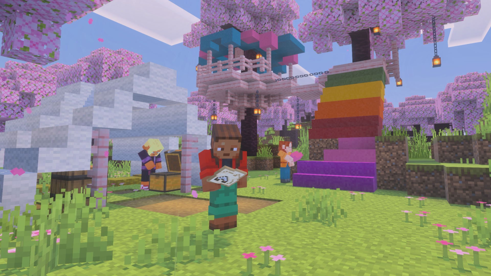

<div align="center">

   

# 基岩版中文译名修正

### 让基岩版也可以拥有更好的中文

#### 修正官方译文 · 统一游戏术语 · 补全版本内容

   

#### [](https://github.com/Minecraft-Kit/mclang_cn/stargazers) [](https://github.com/Minecraft-Kit/mclang_cn/releases) [](https://github.com/Minecraft-Kit/mclang_cn/archive/refs/heads/main.zip)

#### [](https://github.com/Minecraft-Kit/mclang_cn/commits/main) [](LICENSE)

</div>

---

## 📖 关于项目

**基岩版中文译名修正**是一个社区驱动的 Minecraft 简体中文语言修正项目。

项目主要针对游戏现有中文译文中存在的 **翻译错误、语义偏差、表达不自然、术语不统一**等问题进行修正，同时补充官方语言文件中未公开、隐藏或特定平台独有的文本。

在修正过程中，我们尽可能遵循 Minecraft 现有的官方术语体系，并结合中文语言习惯与玩家社区的通用表达，对游戏中的中文文本进行调整。

### 🌐 [项目网站](https://kit.minecraft.spectrollay.com/mclang_cn/)

项目网站使用 [OreUI](https://github.com/Spectrollay-OreUI/OreUI) 技术构建。访问和使用项目网站，即代表你已阅读并同意相关使用条款与免责声明。

### 🎮 适用范围

本项目主要面向基于 **基岩引擎**开发的 Minecraft 游戏版本，包括：

* **基岩版 | 教育版 | 试玩版 | 基岩版编辑器**

不同平台及版本的具体使用方式可能有所不同，请参阅下方的 [安装使用](#-安装使用) 章节。

---

## ✨ 项目特点

| 特点            | 说明                                                     |
|:----------------|:---------------------------------------------------------|
| 🎯 **精准校对** | 修正官方译文中的错误、语病以及不符合中文表达习惯的内容。 |
| 📖 **语义优化** | 在保持原意的基础上优化中文表达，使译文更加自然、准确。   |
| 🧩 **术语统一** | 遵循 Minecraft 官方术语体系，避免同一概念的多种译法。    |
| 🔍 **内容补充** | 适配隐藏文本、调试信息以及部分平台或版本独有的内容。     |
| ⚡ **持续更新** | 持续跟进 Minecraft 正式版及开发版的语言内容变化。        |
| 📦 **开箱即用** | 以标准 `.mcpack` 资源包形式发布，导入后即可使用。        |
| 🤝 **社区驱动** | 欢迎提交问题、建议与贡献，共同完善项目。                 |

---

## 🚀 安装使用

### 1. 下载语言包

你可以从 GitHub、Gitee、Gitea 或项目官方网盘获取语言包。

 

> 适用于正式版的稳定更新。具体适配版本及更新内容请参阅对应的发布说明。

下载： [GitHub](https://github.com/Minecraft-Kit/mclang_cn/releases/latest) | [Gitee](https://gitee.com/Spectrollay/mclang_cn/releases) | [Gitea](https://gitea.com/Spectrollay/mclang_cn/releases/latest) | [项目官方网盘](https://pan.huang1111.cn/s/E74A7Fb)

 

> 包含正式版及预览版发布。预览版主要用于测试开发版适配以及语言包自身的更新，可能会不大稳定。

下载： [GitHub](https://github.com/Minecraft-Kit/mclang_cn/releases) | [Gitee](https://gitee.com/Spectrollay/mclang_cn/releases) | [Gitea](https://gitea.com/Spectrollay/mclang_cn/releases) | [项目官方网盘](https://pan.huang1111.cn/s/E74A7Fb)

---

### 2. 安装语言包

下载 `.mcpack` 文件后，可以根据你的使用场景选择以下方式。

#### (1) 直接导入 `.mcpack`（推荐）

这是最简单、最适合普通用户的安装方式。

##### ● Windows

直接 **双击 `.mcpack` 文件**，Minecraft 通常会自动导入资源包。

如果设备上同时安装了多个 Minecraft 版本，可以：

1. 右键点击 `.mcpack` 文件；
2. 选择 **打开方式**；
3. 选择希望导入的 Minecraft 版本。

##### ● Android / iOS

使用系统文件管理器找到 `.mcpack` 文件并点击。

如果系统询问打开方式，请选择 Minecraft。

部分文件管理器可能会将 `.mcpack` 识别为文本文件或压缩文件，此时可以通过 **打开方式**手动选择 Minecraft。

> 如果设备上安装了多个 Minecraft 版本，请注意选择正确的版本。

##### ● Xbox / PlayStation / Nintendo Switch

主机平台通常无法直接导入 `.mcpack` 文件。

一种常见方式是：

1. 在 Windows 或移动设备上导入语言包；
2. 创建或打开一个世界；
3. 通过 **Minecraft Realms** 同步带有资源包的世界；
4. 在主机端进入该世界。

也可以使用第三方存档编辑工具进行处理，但相关操作可能较为复杂，并存在数据损坏风险，请自行做好备份。

#### (2) 手动复制资源包

如果 `.mcpack` 无法正常导入，或者你希望直接管理资源包文件，可以使用此方法。

##### ① 解压语言包

将 `.mcpack` 文件重命名为 `.zip`，例如：

```text
CTR_xxx_xxx.mcpack
↓
CTR_xxx_xxx.zip
```

然后解压文件。

解压后请 **保留最外层的语言包文件夹**，目录结构通常类似：

```text
CTR_xxx_xxx/
├── texts/
│   └── zh_CN.lang
├── manifest.json
└── ...
```

其中 `CTR_xxx_xxx/` 是语言包的顶层文件夹。

##### ② 将语言包复制到 `resource_packs`

根据你的平台，将整个 `CTR_xxx_xxx/` 文件夹复制到对应的 `resource_packs` 目录。

##### ● Windows

| 版本       | 默认路径                                                                                                                           | 自定义 D 盘安装路径                                                                                                                       |
|:-----------|:-----------------------------------------------------------------------------------------------------------------------------------|:------------------------------------------------------------------------------------------------------------------------------------------|
| UWP 正式版 | `C:\Users\[用户名]\AppData\Local\Packages\Microsoft.MinecraftUWP_8wekyb3d8bbwe\LocalState\games\com.mojang\resource_packs`         | `D:\WpSystem\[设备标识符]\AppData\Local\Packages\Microsoft.MinecraftUWP_8wekyb3d8bbwe\LocalState\games\com.mojang\resource_packs`         |
| UWP 开发版 | `C:\Users\[用户名]\AppData\Local\Packages\Microsoft.MinecraftWindowsBeta_8wekyb3d8bbwe\LocalState\games\com.mojang\resource_packs` | `D:\WpSystem\[设备标识符]\AppData\Local\Packages\Microsoft.MinecraftWindowsBeta_8wekyb3d8bbwe\LocalState\games\com.mojang\resource_packs` |
| GDK 正式版 | `C:\Users\[用户名]\AppData\Roaming\Minecraft Bedrock\Users\Shared\games\com.mojang\resource_packs`                                 | 同默认安装目录                                                                                                                            |
| GDK 开发版 | `C:\Users\[用户名]\AppData\Roaming\Minecraft Bedrock Preview\Users\Shared\games\com.mojang\resource_packs`                         | 同默认安装目录                                                                                                                            |

##### ● Android

| 版本   | 内部存储路径                                                          | 外部存储路径                                                                        |
|:-------|:----------------------------------------------------------------------|:------------------------------------------------------------------------------------|
| 标准版 | `/data/user/0/com.mojang.minecraftpe/games/com.mojang/resource_packs` | `/sdcard/Android/data/com.mojang.minecraftpe/files/games/com.mojang/resource_packs` |
| 改包版 | `/data/user/0/com.mojang.minecraftbe/games/com.mojang/resource_packs` | `/sdcard/Android/data/com.mojang.minecraftbe/files/games/com.mojang/resource_packs` |

> Android 版本、设备权限及文件管理器可能影响实际路径和访问方式。本处假设改包版包名为 `com.mojang.minecraftbe`。

##### ● iOS

由于 iOS 的应用沙盒机制，普通用户通常无法直接访问 Minecraft 的内部文件。

因此， **iOS 用户建议优先使用方法一导入 `.mcpack`，或者通过 Minecraft Realms 同步资源包。**

手动修改游戏文件通常需要越狱设备或其他特殊工具，并可能带来数据丢失、应用异常等风险。

##### ③ 确认目录结构

复制完成后，目录结构应类似：

```text
.../
└── resource_packs/
    ├── CTR_xxx_xxx/
    │   ├── texts/
    │   │   └── zh_CN.lang
    │   ├── manifest.json
    │   └── ...
    └── ...
```

#### (3) 直接替换游戏语言文件（高级用户）

> ⚠️ **高级操作**
>
> 此方法会直接修改 Minecraft 的安装文件。
>
> 操作不当可能导致游戏无法启动、更新失败或数据损坏。
> **开始操作前请务必备份原始文件。**

该方法适合熟悉 Minecraft 文件结构、APK/IPA 或 Windows 应用文件的高级用户。

##### ● Windows

首先从语言包中提取 `zh_CN.lang`，然后定位 Minecraft 的安装数据目录。

| 版本                | 默认路径                                                                                          | 自定义 D 盘安装路径                                                                 |
|:--------------------|:--------------------------------------------------------------------------------------------------|:------------------------------------------------------------------------------------|
| UWP 正式版          | `C:\Program Files\WindowsApps\Microsoft.MinecraftUWP_[版本号]_[架构]__8wekyb3d8bbwe\data`         | `D:\WindowsApps\Microsoft.MinecraftUWP_[版本号]_[架构]__8wekyb3d8bbwe\data`         |
| UWP 测试版 / 预览版 | `C:\Program Files\WindowsApps\Microsoft.MinecraftWindowsBeta_[版本号]_[架构]__8wekyb3d8bbwe\data` | `D:\WindowsApps\Microsoft.MinecraftWindowsBeta_[版本号]_[架构]__8wekyb3d8bbwe\data` |
| GDK 正式版          | `C:\XboxGames\Minecraft for Windows\Content\data`                                                 | `D:\XboxGames\Minecraft for Windows\Content\data`                                   |
| GDK 预览版          | `C:\XboxGames\Minecraft Preview for Windows\Content\data`                                         | `D:\XboxGames\Minecraft Preview for Windows\Content\data`                           |

> 由于 `WindowsApps` 和 `XboxGames` 目录受到系统权限保护，你可能需要管理员权限才能访问。

在数据目录及其子目录中：

1. 搜索所有 `zh_CN.lang` 文件；
2. 备份原始文件；
3. 删除原有的 `zh_CN.lang`；
4. 找到 `resource_packs\vanilla\texts`；
5. 将项目提供的 `zh_CN.lang` 复制进去。

最终结构类似：

```text
data/
├── resource_packs/
│   ├── vanilla/
│   │   ├── texts/
│   │   │   ├── en_US.lang
│   │   │   ├── zh_CN.lang
│   │   │   └── ...
│   │   └── ...
│   └── ...
└── ...
```

完成后重新启动游戏即可。

##### ● Android

首先，获取 Minecraft 安装包，通常为 `.apk` 或 `.apks`。
如果获取到的是 `.apks`，需要使用专门的打包工具处理以及去除安装包的正版校验。

然后：

1. 使用解压或 APK 工具打开安装包；
2. 定位到 `/assets/assets`；
3. 搜索其中所有 `zh_CN.lang` 文件；
4. 备份原始文件；
5. 删除原有的 `zh_CN.lang`；
6. 定位到 `/resource_packs/vanilla/texts`；
7. 将项目提供的 `zh_CN.lang` 复制进去；
8. 重新打包并签名 APK；
9. 安装修改后的游戏。

> **关于重复键**
>
> 由于 Android 版本的语言文件可能被拆分为多个文件，直接替换后可能存在键值重复的问题。
> 本项目提供的语言文件中，对于重复键通常仅保留适用范围最广的一条，其余内容会被注释。如果需要使用其他译文，可以根据实际情况手动解除注释。

当然，另一种方式是不删除原有语言文件，而是将项目提供的译文按照章节分别复制到对应的 `zh_CN.lang` 文件中。

这种方式可以更加精确地保留游戏原有的文件结构，但需要逐个处理所有相关语言文件，操作也更加繁琐。

##### ● iOS

首先获取 Minecraft 的 `.ipa` 安装包。

然后：

1. 解压 `.ipa`；
2. 定位到 `/Payload/minecraftpe.app/data`；
3. 搜索其中所有 `zh_CN.lang`；
4. 备份原始文件；
5. 删除原有的 `zh_CN.lang`；
6. 定位到 `/resource_packs/vanilla/texts`；
7. 将项目提供的 `zh_CN.lang` 复制进去；
8. 重新打包 `.ipa`；
9. 根据设备环境完成重新签名及安装。

与 Android 类似，部分 iOS 版本的语言文件可能存在拆分及重复键问题。

如果不希望删除原文件，也可以按照章节将项目提供的译文分别复制到对应的 `zh_CN.lang` 中。

> iOS 对未签名或重新签名的 `.ipa` 安装存在额外限制，具体操作取决于设备环境及所使用的安装工具。

### 3. 激活语言包

如果你使用的是 **方法一或方法二**，完成导入后还需要在 Minecraft 中启用语言包。

1. 打开 Minecraft，在主界面进入 **设置**；
2. 在侧边栏的 **通用** 中找到 **全局资源**；
3. 在 **我的资源包** 中找到 **中文译名修正包**；
4. 点击资源包，并选择 **激活**；
5. 确认语言包位于 **已激活资源包** 列表的最顶端。

如果语言包没有位于最顶端，可以选中语言包后，使用下方的 **向上箭头**将其移动到最顶部。

> **为什么需要放在最顶端？**
>
> Minecraft 的资源包会按照优先级处理相同资源。将本项目放在最顶端，可以确保修正后的语言文件优先于其他资源包中的对应文件。

---

## 🤝 参与贡献

这是一个持续维护的社区项目，我们欢迎任何形式的贡献。

你可以通过以下方式参与：

* 提交翻译问题；
* 提出术语修改建议；
* 报告遗漏或错误；
* 提交新的文本修正；
* 协助适配新的 Minecraft 版本。

详细的贡献方式与规范请参阅： **[贡献指南](CONTRIBUTING.md)**

---

## 💬 联系与交流

如果你希望反馈问题、讨论翻译或获取使用帮助，可以加入我们的社区：

[](https://t.me/spectrollay_workshop) [](https://qm.qq.com/q/AqLmKLH9mM) [](https://yhfx.jwznb.com/share?key=VyTE7W7sLwRl&ts=1684642802)

---

## 🔗 相关链接

### 项目

* **本项目隶属于**: [Minecraft 工具包](https://github.com/Minecraft-Kit)
* **项目网站：** [基岩版中文译名修正](https://kit.minecraft.spectrollay.com/mclang_cn/)
* **源代码：** [GitHub](https://github.com/Minecraft-Kit/mclang_cn)

### 参考资料

* [Minecraft Wiki](https://zh.minecraft.wiki)
* [Crowdin](https://crowdin.com/translate/minecraft/10038/enus-zhcn)

---

## 📜 开源许可

本项目基于 **[Creative Commons Attribution-NonCommercial-ShareAlike 4.0 International (CC BY-NC-SA 4.0)](LICENSE)** 许可协议授权。

在遵守许可协议的前提下，你可以：

* **共享** — 以任何媒介或格式复制、发行本作品；
* **演绎** — 修改、转换本作品，或基于本作品进行创作。

但必须遵守以下条件：

* **署名（BY）** — 必须给予适当署名，并提供许可证链接，同时说明是否进行了修改；
* **非商业性（NC）** — 不得将本作品用于商业目的；
* **相同方式共享（SA）** — 如果基于本作品进行再创作，必须以相同许可协议发布。

完整许可条款请参阅 [LICENSE](LICENSE)。

---

<div align="center">

**© 2020 Spectrollay | 用❤️制作**

<sub>本项目与 Mojang Studios、Microsoft 或 Minecraft 官方没有隶属关系。</sub>

</div>
